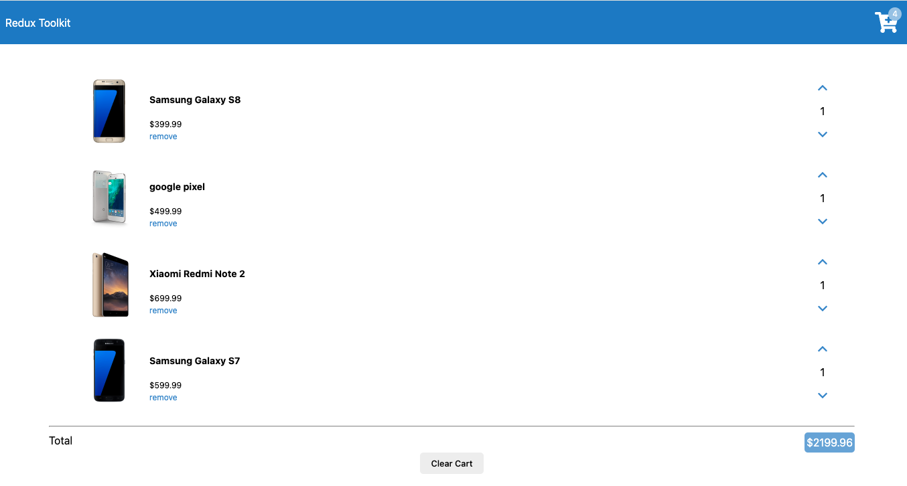
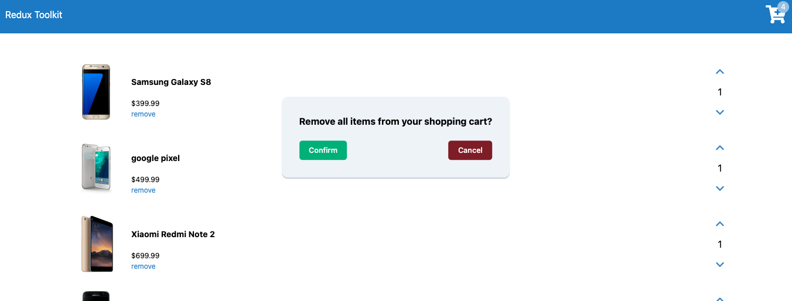

Project with redux tool kit

https://redux-toolkit.js.org/introduction/getting-started

npm install react-redux
npm install @reduxjs/toolkit

#### @reduxjs/toolkit

consists of few libraries

- redux (core library, state management)
- immer (allows to mutate state)
- redux-thunk (handles async actions)
- reselect (simplifies reducer functions)

#### Extras

- redux devtools
- combine reducers

