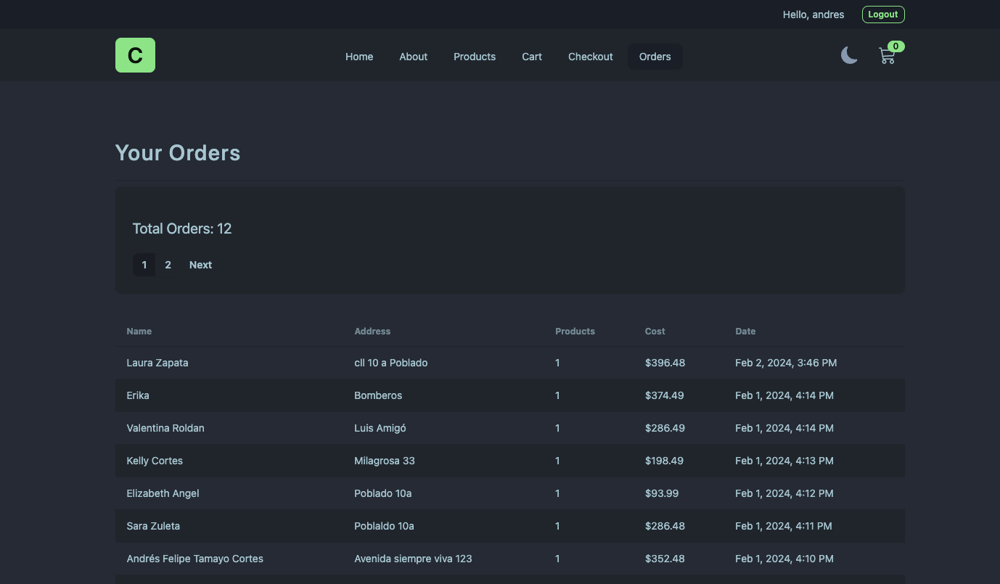
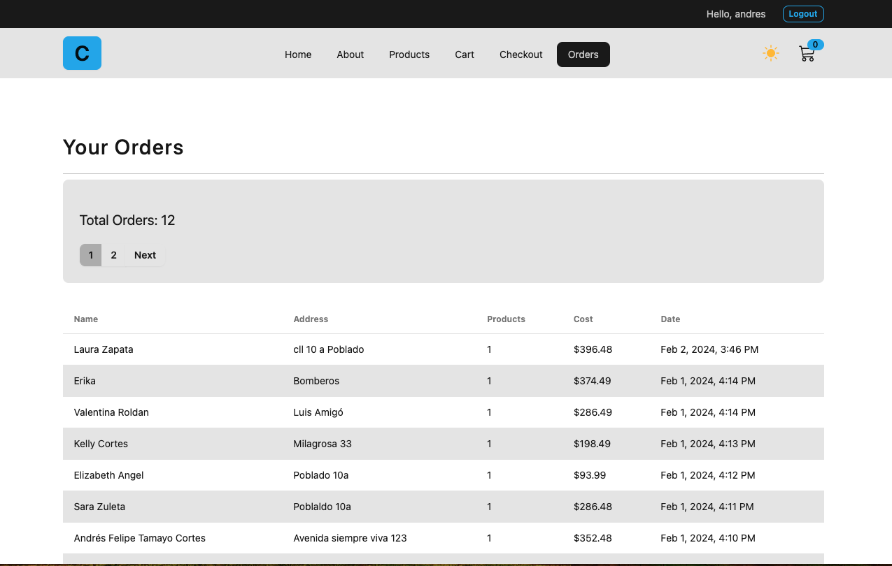
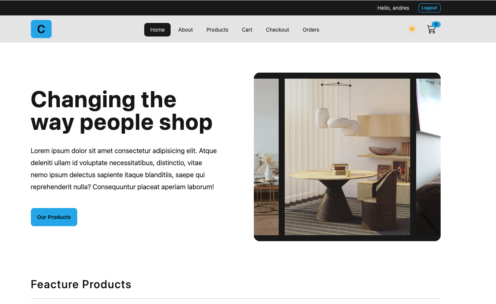
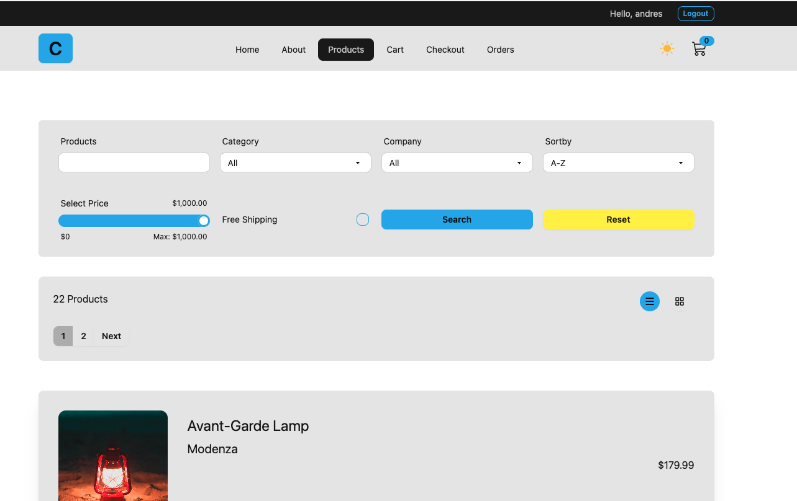
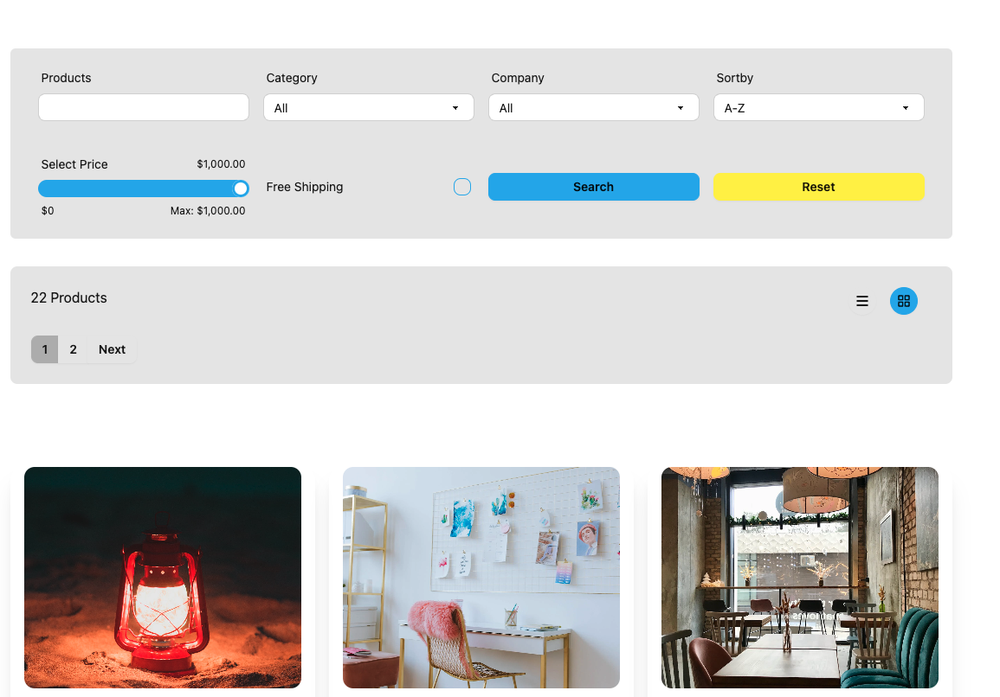
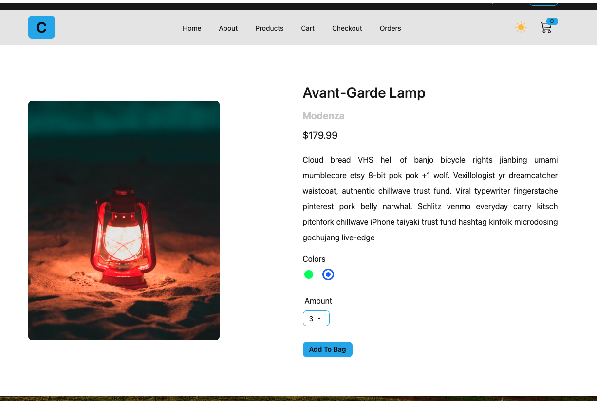
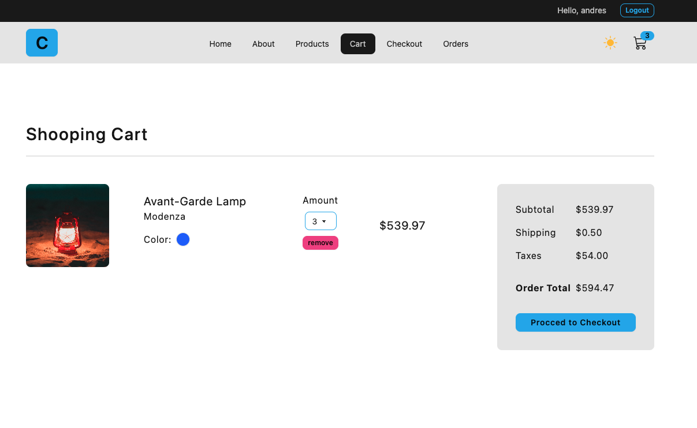
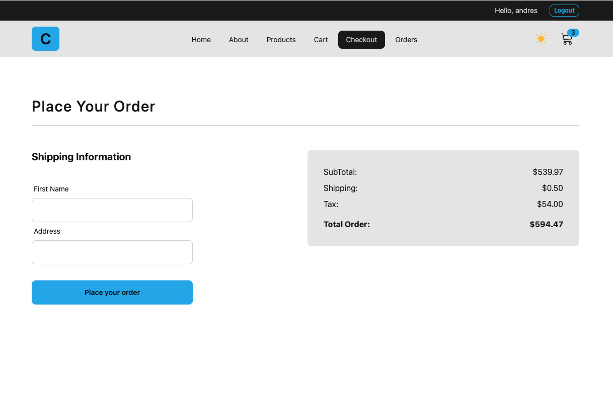

## tailwind installation withe vite

https://tailwindcss.com/docs/guides/vite

    npm install -D tailwindcss postcss autoprefixer
    npx tailwindcss init -p

    update tailwind.config.js file: 

    export default {
    content: [
        "./index.html",
        "./src/**/*.{js,ts,jsx,tsx}",
    ],
    theme: {
        extend: {},
    },
    plugins: [],
    }

    update index.css file or App.css with the following content:
    @tailwind base;
    @tailwind components;
    @tailwind utilities;

## DaisyUI installation.
    https://daisyui.com/docs/install/

    npm i -D daisyui@latest
    npm i -D @tailwindcss/typography

    Then add daisyUI to your tailwind.config.js files:

    {
    //...
    plugins: [require("daisyui"),require("@tailwindcss/typography")],
    }

    documentation:
    https://daisyui.com/components/button/

## OTher libraries 

    https://www.npmjs.com/package/react-router-dom
    https://reactrouter.com/en/main/start/tutorial
    npm i --save react-router-dom

    npm install --save react-icons
    documentation
    https://react-icons.github.io/react-icons/

    https://axios-http.com/docs/example
    npm install --save axios 

    https://redux-toolkit.js.org/introduction/getting-started

    npm install react-redux
    npm install @reduxjs/toolkit

    https://www.npmjs.com/package/react-toastify
    npm install --save react-toastify

    "@tanstack/react-query-devtools": "^5.14.5",

    https://tanstack.com/query/latest
    npm i @tanstack/react-query

    https://tanstack.com/query/v4/docs/framework/react/devtools
    npm i @tanstack/react-query-devtools

## API documentation

    https://documenter.getpostman.com/view/18152321/2s9Xy5KpTi

##

